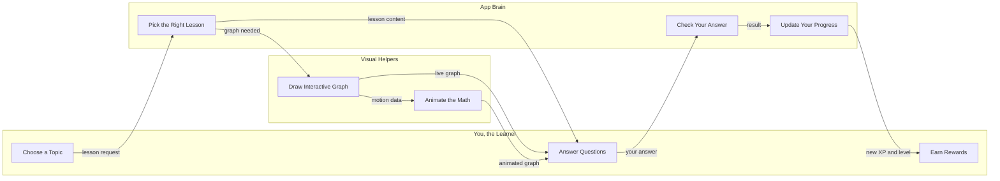

# CalQuest - Interactive Calculus Learning App

**Master calculus through interactive visualizations and gamified learning!**

CalQuest is a Duolingo-style educational app that teaches essential calculus concepts (derivatives, integrals, limits) through mind-blowing interactive visualizations and gamification.

## Features

- **Gamified Learning** - Streaks, XP, levels, and achievement badges
- **Interactive Visualizations** - Beautiful Plotly.js graphs showing calculus concepts
- **Modern Dark UI** - Stunning dark mode interface with smooth animations
- **Progressive Learning** - From basic limits to astrophysics applications
- **Responsive Design** - Works perfectly on mobile, tablet, and desktop
- **Accessible** - WCAG 2.1 AA compliant

## Tech Stack

- **React 18** - Modern React with hooks
- **Vite** - Lightning-fast build tool
- **TailwindCSS** - Utility-first CSS with custom dark theme
- **Framer Motion** - Smooth, professional animations
- **Plotly.js** - Interactive 2D/3D graphs
- **Zustand** - Lightweight state management
- **Firebase** - Backend and authentication (optional)

## Installation

```bash
# Install dependencies
npm install

# Start development server
npm run dev

# Build for production
npm run build

# Preview production build
npm run preview
```

## Project Structure

```
calquest/
├── src/
│   ├── components/          # React components
│   │   ├── Header.jsx
│   │   ├── Dashboard.jsx
│   │   ├── LessonSelector.jsx
│   │   └── visualizers/     # Interactive visualizations
│   ├── store/               # Zustand state management
│   │   └── userStore.js
│   ├── utils/               # Utility functions
│   │   ├── calculus.js      # Math functions
│   │   └── animations.js    # Framer Motion variants
│   ├── App.jsx              # Main app component
│   ├── main.jsx             # Entry point
│   └── index.css            # Global styles
├── public/                  # Static assets
├── index.html
├── package.json
├── vite.config.js
└── tailwind.config.js
```

## Color Scheme

- **Primary**: `#3B82F6` (Bright Blue)
- **Secondary**: `#10B981` (Emerald Green)
- **Accent**: `#F59E0B` (Amber)
- **Background**: `#0F172A` (Dark Navy)
- **Success**: `#22C55E` (Green)
- **Error**: `#EF4444` (Red)

## Learning Modules

1. **Limits** - Understanding approach & convergence
2. **Derivatives** - Slopes, velocity, acceleration
3. **Integrals** - Area, volume, accumulation
4. **Astrophysics Applications** - Real-world physics problems

## Gamification Elements

- **Streaks** - Daily learning streaks
- **XP System** - Earn points for completing lessons
- **Levels** - Progress from Level 1 to 30
- **Achievements** - Unlock badges for milestones

## Next Steps

- [ ] Add interactive visualizers (SlopeVisualizer, IntegralVisualizer, LimitVisualizer)
- [ ] Create quiz system with multiple question types
- [ ] Add concept introduction screens
- [ ] Implement Firebase authentication
- [ ] Add sound effects and celebrations
- [ ] Create astrophysics applications module

## Documentation

See the specification documents in the root directory:
- `Calculus-App-Prompt.md` - Complete project vision
- `Calculus-App-Design-UI.md` - UI/UX specifications
- `Calculus-App-Implementation.md` - Implementation guide

## System Architecture

### How the App Fits Together



### How It Works

| Step | What Happens |
|------|--------------|
| 1 | You open the app and pick a topic — like Derivatives or Integrals |
| 2 | The app selects a lesson that matches your current level so it is never too easy or too hard |
| 3 | An interactive graph appears and animates the math concept in real time as you adjust sliders |
| 4 | You answer a question or complete a challenge based on what the graph is showing |
| 5 | The app instantly checks your answer and explains what was right or wrong |
| 6 | You earn XP points and your streak grows, just like in a language learning app |
| 7 | Over time the app unlocks harder topics and real-world problems from physics and astrophysics |

---

## Contributing

This is a personal learning project. Feel free to fork and customize!

## License

MIT License - Feel free to use this for your own learning!

---

**Built for B.Sc. AI/ML students learning calculus for astrophysics**
